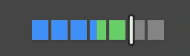

# Codex Pace Bar

Unofficial macOS menu bar app that shows whether your Codex weekly usage is below pace, on pace, or above pace.

## Download

**[Download the latest ready build for macOS](https://github.com/awronski/codex-pace-bar/releases/latest/download/CodexPaceBar.dmg)**


Codex Pace Bar answers one question at a glance: are you using your weekly Codex limit faster or slower than the current reset window pace?

> Was I rushing, or was I dragging?

<p>
  
</p>

## Status

Ready DMG builds are available from GitHub Releases. The package script ad-hoc signs local builds by default and supports Developer ID signing and Apple notarization for public releases.

The app depends on Codex's local app-server API, so future Codex CLI changes may require an app update.

## Requirements

### To Run

- macOS 15.0 or newer.
- [Codex CLI](https://developers.openai.com/codex/cli) installed and already logged in.

Codex Pace Bar starts the local Codex app-server through the Codex CLI. By default it looks for `codex` on your `PATH`, then checks common install locations such as `/opt/homebrew/bin/codex`, `/usr/local/bin/codex`, `~/.local/bin/codex`, mise-managed `npm-openai-codex` installs, `~/.npm-global/bin/codex`, and `~/.bun/bin/codex`.

If your Codex CLI is installed somewhere else, set the exact executable path in Settings.

### To Build

- Swift 6 toolchain / Xcode command line build tools.

## What It Shows

- Seven visual segments representing the full weekly limit window.
- Filled usage based on Codex rate-limit data.
- A vertical pace marker based on exact elapsed time in the current reset window.
- A popover with used, ideal, remaining, reset time, and hours until reset.
- If usage is above pace, the popover shows how long to wait for the ideal pace to catch up.
- A chart of usage percentage during the current weekly window.
- A run-out forecast that learns recency-weighted hourly usage patterns for workdays and weekends from the last 30 days, then adapts their intensity to the current window.
- A recent-pace forecast while the history-based model is still learning.
- When the separate local Activity Insights (Beta) collector is explicitly enabled, one optional chart
  row showing observed Codex time split between hands-on and hands-off work. Totals are labeled
  as observed Codex time, while a stopped collector is still identified as stale.



## Settings


Settings are intentionally small:

- Codex executable path.
- Refresh interval.
- Pace delta threshold.
- Daily notification when usage is well above pace.
- Forecast notification when predicted usage indicates the weekly limit may run out before reset.
- A disabled-by-default Activity Insights (Beta) collector toggle and its local status.
- History-based forecasting, enabled by default and configurable in Settings.
- Launch at login, enabled by default and configurable in Settings.
- Bar color scheme.
- Installed app version with a link to the GitHub repository.

Settings are stored in `UserDefaults`.
Usage history is stored locally in Application Support for 30 days. The JSON includes its schema version and the app version that last wrote it, while older unversioned history remains readable. Reset metadata never deletes it; the chart derives the current continuous usage series from the retained archive. Within one confirmed reset window, the chart and forecast use a high-water mark so stale lower readings do not create false drops or recovery usage, while the raw readings remain available for diagnostics. A validated rolling backup protects the previous file state.

History-based forecasting groups observed percentage-point changes by workday or weekend and local hour. Recent weeks receive more weight, token reset transitions are excluded, and gaps longer than 90 minutes are not assigned to a specific working period. After 24 hours in the current reset window, the model gradually adapts the learned intensity toward the current window's pace while preserving the learned hourly shape. The chart plots the resulting hourly projection directly, so expected inactive periods appear as plateaus instead of being averaged into a straight line. The learned model requires at least seven days of history, 24 hours of usable observations, and one percentage point of observed usage. Until then, the app falls back to the recent-pace forecast, which requires three samples spanning 30 minutes and one percentage point of change.

## Build And Run

This project is intentionally shell-built. It does not require creating or opening an Xcode project.

```bash
./script/build_and_run.sh --verify
```

The script builds the SwiftPM executable, stages `dist/Codex Pace Bar.app`, launches it, and verifies that the process is running.

Run tests with:

```bash
DEVELOPER_DIR=/Applications/Xcode.app/Contents/Developer swift test
```

Depending on your local Swift toolchain setup, `DEVELOPER_DIR` may not be needed.

## Package DMG

Create a local ad-hoc-signed DMG:

```bash
./script/package_dmg.sh
```

Create a Developer ID-signed DMG for release:

```bash
SIGNING_IDENTITY="Developer ID Application: Your Name (TEAMID)" ./script/package_dmg.sh
```

Create a signed and notarized release DMG using a stored `notarytool` profile:

```bash
SIGNING_IDENTITY="Developer ID Application: Your Name (TEAMID)" \
NOTARIZE=1 \
NOTARY_PROFILE="your-notary-profile" \
./script/package_dmg.sh
```

The script builds the app in release mode, signs the app bundle, and writes `dist/CodexPaceBar.dmg`. With `NOTARIZE=1`, it submits and staples both the app and DMG.

Ad-hoc signing is enough to seal the local app bundle, but it is not a substitute for Apple Developer ID signing and notarization. Public downloads may still show Gatekeeper warnings until release builds are notarized.

## Privacy

Codex Pace Bar is local-only.

- No analytics or telemetry are sent anywhere.
- No external backend.
- No network calls from this app.
- No OpenAI credentials are requested or stored.
- Account and rate-limit data is read only through the local Codex app-server using your existing Codex session.
- Usage history contains local timestamps, percentage used, limit identifiers, and reset metadata for up to 30 days.

The optional Activity Insights collector is a beta feature implemented as a separate,
disabled-by-default local process. When enabled, it stores sanitized task
provenance/timing/input-length facts and aggregate active-at-Mac
and Codex-focus states for up to 30 days. Prompt text is processed locally only to count characters
and UTF-8 bytes and is never written to the archive. It does not capture keystrokes, other app
names, window titles, URLs, or a global input stream. The chart reads only a versioned seven-day
aggregate snapshot. Settings invokes a bundled control helper to enable, disable, or refresh the
independent user LaunchAgent; pace history, forecasting, and refresh components never open or
write the Activity Insights archive.

Activity Insights estimates active-at-Mac time from input idle duration and cannot decide whether
the activity was productive work. It polls persisted Codex task history, so completed Codex work
during sampler gaps is retained with unknown user/focus state. As a beta, its results are
directional and can be incomplete while history and activity coverage accumulate. The development
quality gate targets at least 95% history/focus/four-state coverage and two independent controlled
truth sets (task metadata and state intervals) containing at least 20 unique cases across seven UTC
work days. Passing state cases must cover every active/inactive × working/idle combination plus both
foreground and background Codex-working intervals. Keep the real
`docs/activity-insights-validation-manifest.json` local; the tracked example documents its
prompt-free schema.

Run the controlled local gate after building the audit helper:

```bash
swift build -c release --product ActivityInsightsAudit
.build/release/ActivityInsightsAudit validate \
  --manifest docs/activity-insights-validation-manifest.json \
  --lookback-days 7
```

Debug information is redacted and limited to operational details such as selected executable path, app-server status, detected window durations, percentage values, reset timestamp presence, errors, and timestamps.

## Unofficial Project

Codex Pace Bar is an unofficial third-party project. It is not affiliated with, endorsed by, sponsored by, or maintained by OpenAI.

Codex, OpenAI, and related names are trademarks or registered trademarks of their respective owners.

## Limitations

- The app depends on Codex's local app-server interface.
- The app-server API is experimental.
- The app currently targets macOS 15.0+.
- Local ad-hoc builds are not notarized; public releases should continue to use Developer ID signing and notarization.
- Forecasts use percentage-based usage history because the app-server rate-limit response does not provide raw token spending totals.

## License

MIT. See [LICENSE](LICENSE).
